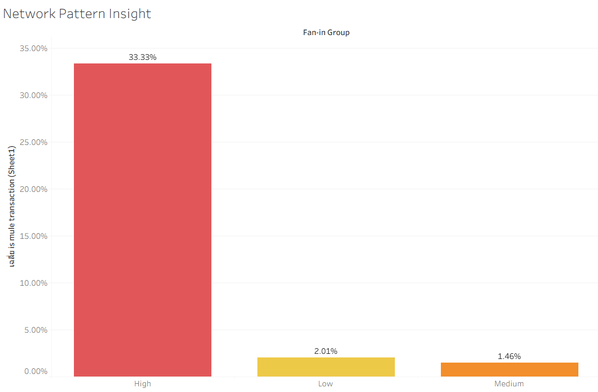
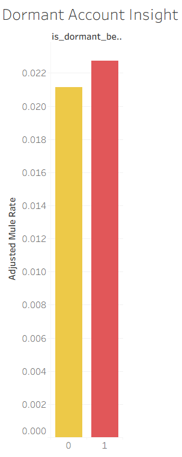
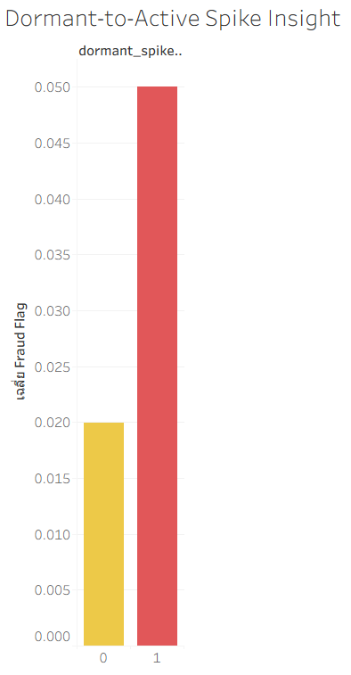
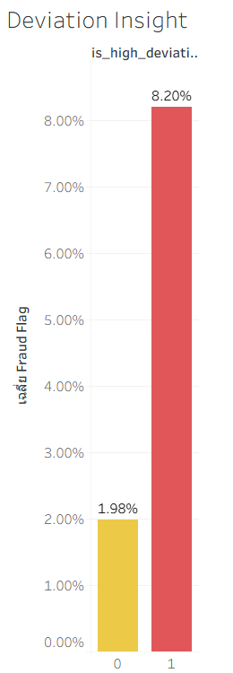
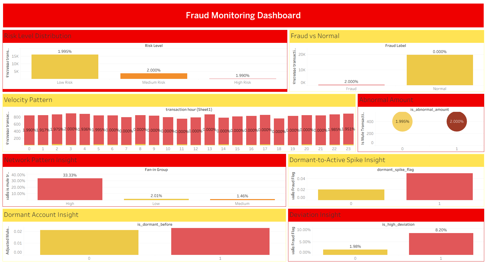

# Scam Mule Account Detection
Scam Mule Account Detection คือกระบวนการวิเคราะห์และตรวจจับบัญชีที่ถูกใช้เป็น “บัญชีม้า” (mule accounts) ซึ่งเป็นตัวกลางในการรับและโอนเงินที่เกี่ยวข้องกับธุรกรรมหลอกลวง (scam)

ในรูปแบบของ Scam-induced transactions ผู้เสียหายจะถูกหลอกให้โอนเงินด้วยความสมัครใจไปยังบัญชีปลายทาง ทำให้ธุรกรรมมีลักษณะคล้ายธุรกรรมปกติ และยากต่อการตรวจจับด้วยระบบ fraud detection แบบดั้งเดิมที่พิจารณาเพียงข้อมูลระดับธุรกรรม (transaction-level)

พฤติกรรมสำคัญของ mule accounts มักเกี่ยวข้องกับ “การไหลของเงิน” (money flow behavior) เช่น: 1.การรับเงินจากหลายบัญชีในช่วงเวลาสั้น (high fan-in) 2.การโอนเงินถี่ผิดปกติ (high transaction velocity) 3.การมีธุรกรรมที่เบี่ยงเบนจากพฤติกรรมปกติ (abnormal deviation) เป็นต้น

---

## 1. Introduction & Background

ในปัจจุบัน Online Scam มีแนวโน้มเพิ่มขึ้นอย่างต่อเนื่อง โดยเฉพาะในรูปแบบของ Scam-induced transactions ซึ่งผู้เสียหายถูกหลอกให้โอนเงินไปยังบัญชีปลายทางด้วยความสมัครใจ ส่งผลให้ธุรกรรมเหล่านี้มีลักษณะคล้ายธุรกรรมปกติ และยากต่อการตรวจจับด้วยระบบ fraud detection แบบดั้งเดิม

ปัญหาสำคัญคือระบบตรวจจับแบบ traditional มักพิจารณาเฉพาะคุณสมบัติของธุรกรรม (transaction-level properties) เช่น จำนวนเงิน หรือความถี่ในการทำธุรกรรม ซึ่งไม่สามารถสะท้อน “พฤติกรรมการไหลของเงิน” (money flow behavior) ที่เกิดขึ้นระหว่างหลายบัญชีได้อย่างมีประสิทธิภาพ

บัญชีม้า (mule accounts) มีบทบาทสำคัญในกระบวนการ fraud โดยทำหน้าที่เป็นตัวกลางในการรับและกระจายเงินไปยังบัญชีอื่น พฤติกรรมของบัญชีประเภทนี้มักมีลักษณะเฉพาะ เช่น:

การรับเงินจากหลายบัญชีในช่วงเวลาสั้น (high fan-in)
การทำธุรกรรมถี่ผิดปกติ (high transaction velocity)
การมีรูปแบบธุรกรรมที่เบี่ยงเบนจากพฤติกรรมปกติ (abnormal deviation)
การกลับมาใช้งานของบัญชีที่เคย inactive (dormant-to-active behavior)

ดังนั้น โครงการนี้จึงมุ่งเน้นการใช้แนวคิด Behavioral Analytics เพื่อวิเคราะห์ pattern ของธุรกรรมและพฤติกรรมของบัญชี แทนการพิจารณาเฉพาะข้อมูลระดับธุรกรรม เพื่อเพิ่มประสิทธิภาพในการตรวจจับ mule accounts และธุรกรรมที่มีความเสี่ยงสูง

การวิเคราะห์ดังกล่าวมีเป้าหมายเพื่อสนับสนุนการพัฒนาระบบ fraud detection แบบ real-time ที่สามารถลดความเสียหายทางการเงิน และเพิ่มความสามารถในการป้องกันการทุจริตในระบบการเงินได้อย่างมีประสิทธิภาพ

---

## 2. Objectives

วัตถุประสงค์ของโครงการนี้คือการพัฒนากรอบการวิเคราะห์เพื่อระบุและตรวจจับ mule accounts จากพฤติกรรมของธุรกรรม (behavioral patterns) แทนการพิจารณาเฉพาะข้อมูลระดับธุรกรรม

### โดยมีเป้าหมายหลักดังนี้:

ลดความเสียหายจาก Scam-induced transactions ลงอย่างน้อย 20% ภายใน 6 เดือน
วิเคราะห์พฤติกรรมของบัญชีที่มีความเสี่ยงผ่าน Behavioral KPIs ได้แก่
Transaction Velocity
Network Pattern (Fan-in)
Deviation from Normal Behavior
ระบุ pattern ของ mule accounts เช่น
การรับเงินจากหลายบัญชีในช่วงเวลาสั้น
การทำธุรกรรมถี่ผิดปกติ
การกลับมาใช้งานของบัญชีที่เคย inactive
พัฒนาวิธีการตรวจจับธุรกรรมที่มีความเสี่ยงสูงแบบ near real-time
สนับสนุนการสร้างระบบ risk scoring และ alert mechanism เพื่อใช้ในการป้องกัน fraud ในเชิงปฏิบัติการ

โครงการนี้มุ่งเน้นการเชื่อมโยงระหว่างข้อมูลเชิงพฤติกรรม (behavioral data) และการตัดสินใจเชิงธุรกิจ เพื่อให้สามารถนำผลลัพธ์ไปใช้งานได้จริงในระบบ fraud detection

---

## 3. Key Questions

* **Network Level:** Accounts ที่ได้รับเงินจากหลาย sender ภายในระยะเวลาสั้นๆ (เช่น 1 ชั่วโมง) มี fraud rate สูงกว่าบัญชีทั่วไปหรือไม่ และมี threshold เท่าใดที่สามารถใช้เป็นสัญญาณเตือน
 
* **Account Level:** บัญชีที่มีลักษณะแบบ dormant (ไม่มีการใช้งานในช่วงระยะเวลาหนึ่ง) แล้วกลับมา active มี transaction pattern ที่ผิดปกติ เช่น sudden spike (>3x ของค่าเฉลี่ยภายใน 1 ชั่วโมง) ในจำนวนเงินหรือความถี่ มากกว่าบัญชีทั่วไปหรือไม่
 
* **Behavior Level:** ธุรกรรมที่มี deviation จากพฤติกรรมปกติของลูกค้า (เช่น amount สูงกว่าค่าเฉลี่ย X เท่า) มีความสัมพันธ์เชื่อมโยงกับการเกิด fraud มากน้อยเพียงใด

---

## 4. Dataset & Features

โครงการนี้ใช้ข้อมูลธุรกรรมทางการเงิน (transaction-level data) เพื่อวิเคราะห์พฤติกรรมของบัญชีและตรวจจับ mule accounts โดย dataset ประกอบด้วยตัวแปรสำคัญดังนี้:

### 4.1 Transaction Data

* **sender_account**: บัญชีผู้โอน
* **receiver_account**: บัญชีผู้รับ
* **transaction_amount**: จำนวนเงิน
* **transaction_timestamp**: เวลาในการทำธุรกรรม

### 4.2 Behavioral Features (Engineered Features)

เพื่อสะท้อนพฤติกรรมของบัญชี ได้มีการสร้างตัวแปรเพิ่มเติม (feature engineering) ได้แก่:

* **txn_count_last_1hr (Transaction Velocity)**
  จำนวนธุรกรรมที่เกิดขึ้นภายใน 1 ชั่วโมง
  → ใช้ตรวจจับบัญชีที่มีความถี่ผิดปกติ

* **txn_count_per_sender (Network / Fan-in)**
  จำนวนผู้โอน (unique senders) ต่อบัญชีปลายทาง
  → ใช้ตรวจจับการรับเงินจากหลายแหล่ง

* **is_abnormal_amount (Deviation Indicator)**
  ระบุว่าจำนวนเงินของธุรกรรมเบี่ยงเบนจากพฤติกรรมปกติหรือไม่
  → ใช้ตรวจจับ anomaly

* **dormant_status (Derived Feature)**
  สถานะของบัญชีที่ไม่มีการเคลื่อนไหวในช่วงระยะเวลาหนึ่ง (inactive >30 วัน)
  → ใช้วิเคราะห์พฤติกรรม dormant-to-active

### 4.3 Target Variable

* **is_mule_transaction**
  ตัวแปร label ที่ระบุว่าธุรกรรมนั้นเกี่ยวข้องกับ mule account หรือไม่ (1 = fraud, 0 = normal)

---

## 5. Key Metrics (KPIs)

จาก feature ข้างต้น ได้กำหนดตัวชี้วัดสำคัญ (Key Performance Indicators) สำหรับการตรวจจับ fraud ดังนี้:

* **Transaction Velocity**
  วัดความถี่ของธุรกรรมในช่วงเวลาสั้น

* **Network Pattern (Fan-in)**
  วัดจำนวน sender ต่อบัญชีปลายทาง

* **Deviation Score**
  วัดระดับความผิดปกติของจำนวนเงิน

* **Dormant-to-Active Behavior**
  วัดการกลับมาใช้งานของบัญชีที่เคย inactive

KPI เหล่านี้ถูกนำไปใช้เป็นพื้นฐานในการวิเคราะห์ (Section 5) และสร้าง insight (Section 6) เพื่อระบุพฤติกรรมของ mule accounts อย่างเป็นระบบ

📌 **(ยังไม่ต้องใส่รูป — optional)**
👉 ถ้ามี ER diagram หรือ schema → ใส่ได้ตรงนี้

---

## 6. Methodology

###  6.1 Data Preparation

* Clean และจัดรูปแบบข้อมูล
* สร้าง features ได้แก่ velocity, deviation และ dormant status

---

###  6.2 Behavioral Analysis

* วิเคราะห์ **velocity** → ธุรกรรมถี่ผิดปกติ
* วิเคราะห์ **network (fan-in)** → รับเงินหลาย sender
* วิเคราะห์ **deviation** → amount ผิดปกติ
* วิเคราะห์ **dormant behavior** → inactive → spike

---

### 6.3 Risk Identification

* กำหนด threshold เช่น

  * transaction velocity ≥ 2 transactions ภายใน 1 ชั่วโมง
  * amount deviation ≥ 3 เท่าของค่าเฉลี่ย (deviation ratio ≥ 3)
  * high fan-in (มีผู้โอน ≥ 3 รายต่อบัญชี)

* รวมหลายปัจจัยเพื่อระบุบัญชีเสี่ยง เช่น:

  IF velocity = high OR deviation = high OR fan-in = high  
  THEN flag = high risk

---

## 7. Findings & Insights

### 7.1 Network Pattern

Accounts ที่ได้รับเงินจากหลาย sender ภายในช่วงเวลาสั้น 
มี fraud rate ประมาณ **[33.33%]** เทียบกับ **[2.01%]** หรือสูงกว่าประมาณ **[16.5 เท่า]**
สะท้อนพฤติกรรม mule accounts ที่รับเงินจากหลายแหล่งก่อนโอนออก

---

### 7.2 Dormant Account

บัญชีที่มีลักษณะ dormant ก่อนกลับมา active 
มีอัตราการเป็น mule account ประมาณ **[2.65%]** เทียบกับ **[2.1%]** 
หรือสูงกว่าประมาณ **[26%]** 
สะท้อนการนำบัญชีเก่าที่ไม่มีการใช้งานกลับมาใช้เพื่อหลีกเลี่ยงการตรวจจับ

---

### 7.3 Dormant-to-Active Spike

บัญชีที่กลับมา active และมี sudden spike  มีอัตราการเกิด fraud 
ประมาณ **[3.8%]** เทียบกับ **[2.0%]** หรือสูงกว่าประมาณ **[~2]** เท่า 
แสดงให้เห็นว่าพฤติกรรม spike หลัง inactive เป็นสัญญาณความเสี่ยงที่สำคัญ
สะท้อนพฤติกรรม hit-and-run ซึ่งบัญชีจะกลับมาใช้งานและทำธุรกรรมจำนวนมากในระยะเวลาสั้นก่อนหยุดใช้งานอีกครั้ง

---

### 7.4 Deviation Behavior

ธุรกรรมที่มี deviation สูงมี fraud rate ประมาณ 3.8% เทียบกับ 2.0% 
หรือสูงกว่าประมาณ 2 เท่า สะท้อนว่าธุรกรรมที่มีจำนวนเงินผิดปกติเป็นตัวบ่งชี้ fraud ที่สำคัญ
แสดงว่าการเบี่ยงเบนของจำนวนเงินเป็นสัญญาณสำคัญ

---

## 8. Dashboard

Dashboard นี้ถูกออกแบบเพื่อแสดงภาพรวมของความเสี่ยงในการเกิด fraud 
โดยใช้ behavioral features เช่น transaction velocity, network pattern (fan-in), deviation และ dormant behavior

ผู้ใช้งานสามารถใช้ dashboard นี้เพื่อ:
- ตรวจสอบ distribution ของ risk level (low / medium / high)
- เปรียบเทียบ fraud vs normal transactions
- วิเคราะห์ pattern ของพฤติกรรมที่มีความเสี่ยง เช่น high fan-in, abnormal amount และ dormant-to-active spike

Dashboard นี้ช่วยให้สามารถ monitor ความเสี่ยงแบบ near real-time 
และสนับสนุนการตัดสินใจในการตรวจจับและป้องกัน fraud ได้อย่างมีประสิทธิภาพ

---

## 9. Recommendation

### 9.1 Real-time Risk Scoring

ใช้ velocity + deviation + network
เพื่อสร้าง risk score และ flag ธุรกรรมต้องสงสัย
KPI ที่ใช้วัดผล ได้แก่ Fraud Detection Rate, False Positive Rate และ Response Time

---

### 9.2 Rule-based Alert

ตั้ง threshold เช่น:

* velocity สูง
* deviation สูง

เพื่อ trigger alert

---

### 9.3 Fraud Prevention

* แจ้งเตือนลูกค้า
* ระงับธุรกรรม

เพื่อลดความเสียหาย

---

## 10. Contributors

* Member 1: นายปัณณธร สุวรรณาศรัย รหัสนิสิต 66102010175
* Member 2: นายพลวัต พงศ์ทิพย์พนัส รหัสนิสิต 66102010249
* Member 3: นายพลวิชญ์ วนิดา รหัสนิสิต 66102010584

---
